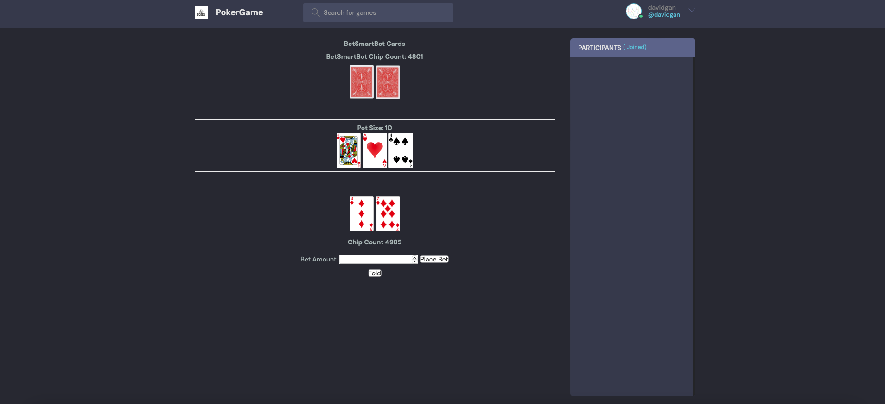
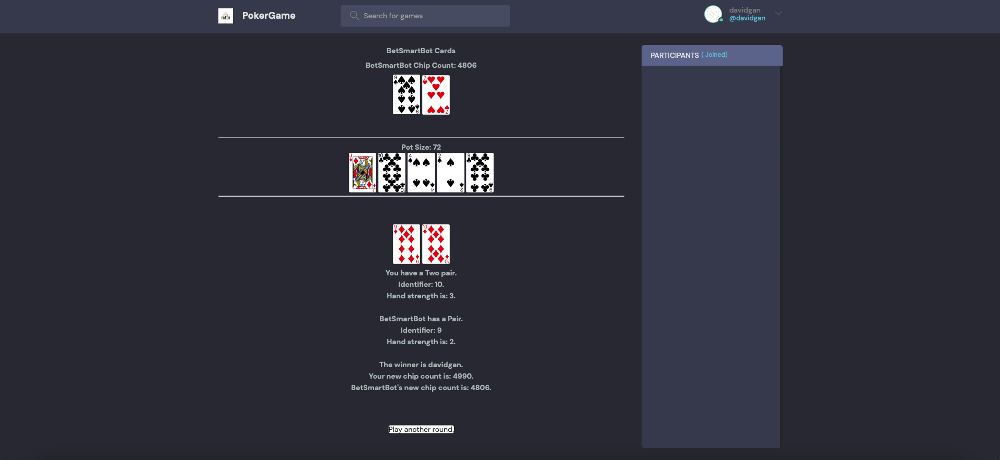

This Django Poker Game Project is a work in progress. As of right now, user authentication and login as well as basic gameplay functionality (including dealing cards, evaluating and comparing hands, betting and folding) against a simple bot with static image displays has been achieved.

# Next Steps
1. Add in blinds functionality (right now, there is no small blind, big blind etc).

2. Merge preflop, flop, turn, river templates into one single template using some sort of status variable. This will minimize excess code and make future changes more efficient.

3. Make BetSmartBot (the game bot) smarter. Look into implementing equity-based approach or even (long-term) explore some sort of machine learning algorithm.

4. Add in text pop-up or animation so that it is more obvious when user or bot bets/checks/folds.

5. Add in multiplayer-functionality and make use of existing room structure.

6. Fix up chat functionality and participant sidebar.

7. Use React for front-end and just query the Django back-end (will need to use Django REST framework), since Django templates are quite limited.

8. Look into adding in other poker games like Blackjack.

