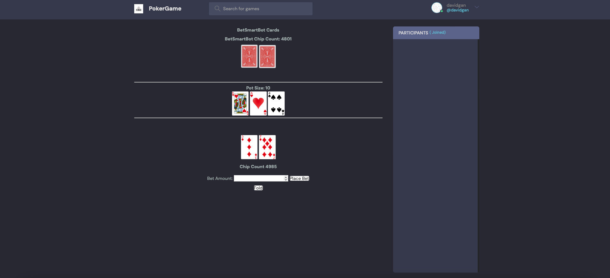

This web app includes user authentication and login as well as gameplay functionality (including dealing cards, evaluating and comparing hands, betting and folding) against a simple bot with static image displays. The majority of the logic and backend implementation is in base/views.py.

