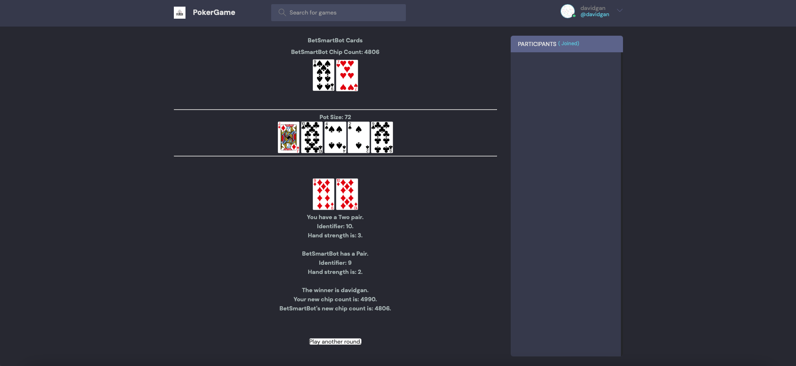

This basic web app includes user authentication and login as well as basic gameplay functionality (including dealing cards, evaluating and comparing hands, betting and folding) against a simple bot with static image displays. The majority of the logic and backend implementation is in base/views.py.

# Potential Next Steps
1. Add in blinds functionality (right now, there is no small blind, big blind etc).

2. Merge preflop, flop, turn, river templates into one single template using some sort of status variable. This will minimize excess code and make future changes more efficient.

3. Make BetSmartBot (the game bot) smarter. Look into implementing equity-based approach or even (long-term) explore some sort of machine learning algorithm.

4. Add in text pop-up or animation so that it is more obvious when user or bot bets/checks/folds.

